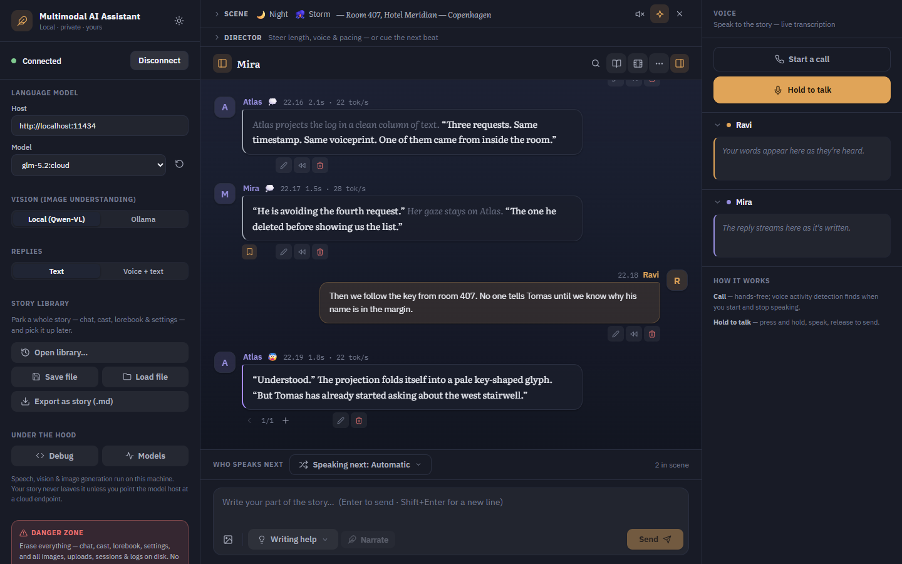
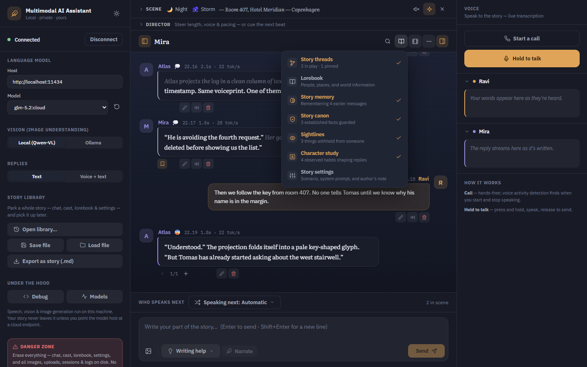
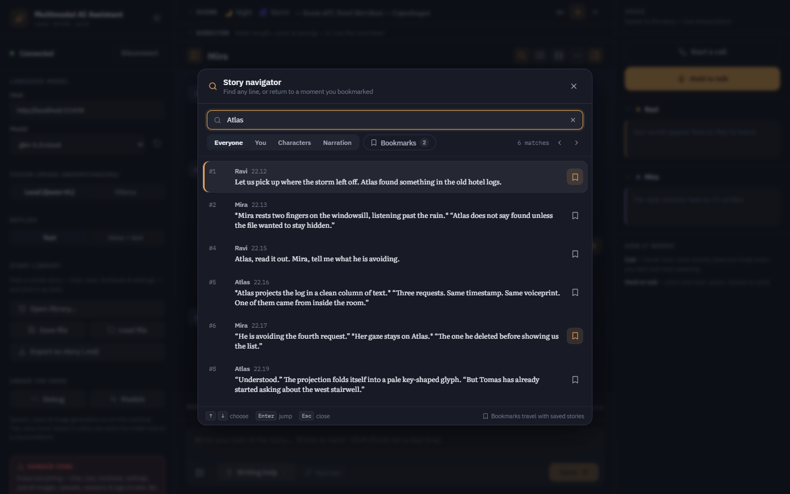
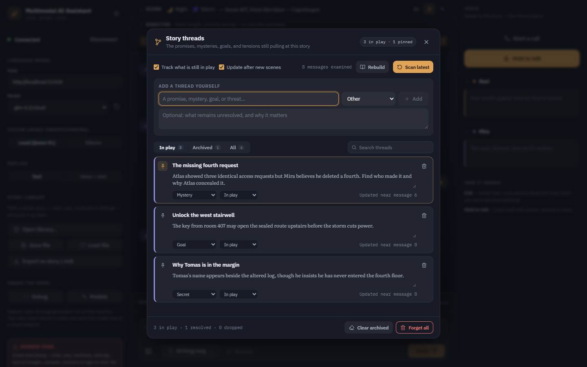
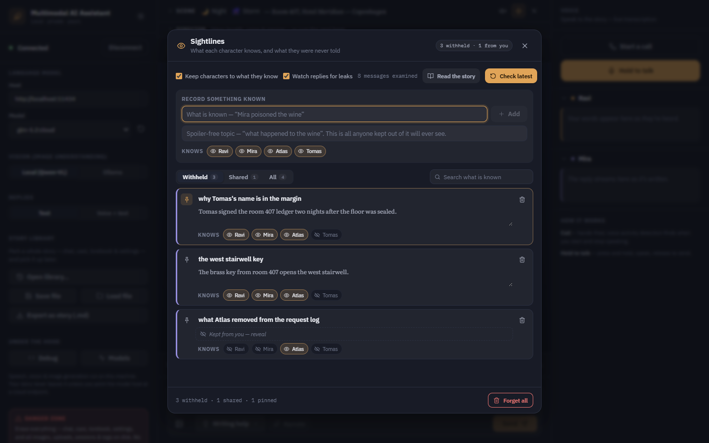
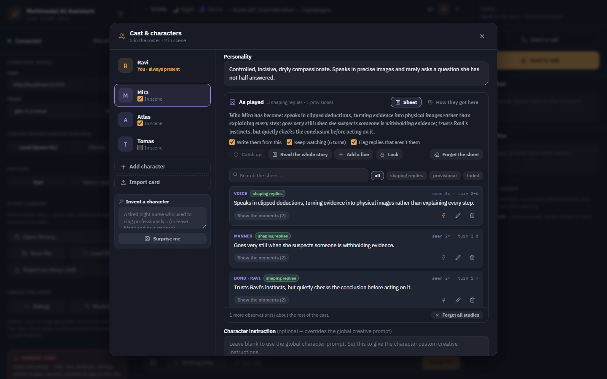

# Multimodal AI Assistant

> A fully-featured (I would like to think so) AI companion (or a poor man's version of AI Girlfriend) that sees, speaks, and creates—all running locally on your machine.

## What is This?

Ever wanted an AI assistant, one that you can set a personality and interact ? One that you can **talk to naturally**, **show images**, and have it **generate visuals** in response? This multimodal AI assistant brings together the best of modern (whatever that is based on my limited understanding) AI capabilities into one seamless (when you have high end PC) experience.

**Note**: This project is being vibe coded (including this ReadMe as well)—built organically and iteratively as ideas flow.

## App Preview

The story workspace keeps local model and voice controls around a focused, cinematic transcript. Scene and director controls stay close to the story, while the Story menu gathers the deeper tools for memory, continuity, open plot threads, character knowledge, and evolving characterization.



| Story controls | Story navigator |
| --- | --- |
|  |  |

| Story threads | Sightlines |
| --- | --- |
|  |  |

| Character study |
| --- |
|  |

## Key Features

### **Natural Conversations**
- Speak naturally using your microphone—no typing required
- Multiple input modes: voice, text, or text + images
- Real-time voice responses with customizable TTS engines
- Phone call mode (with VAD, for smart turns)

### **Visual Understanding**
- Show it an image and describe what you want
- Powered by local vision-language models for privacy
- Understands context from both your words and images

### **Image Generation**
- Creates images based on conversation context
- The AI can autonomously decide when to generate visuals
- Uses local Stable Diffusion for complete privacy

### **Immersive Roleplay & Storytelling**
- **Multiple characters (cast)** — build a roster, each with its own name, description, personality, avatar, and optional per-character system instruction; mark several "in scene" and pick who speaks next
- **Invent a character** — let the model write a whole card. Describe roughly who you want ("a tired night nurse who used to sing professionally") and it writes them; leave the box empty and it invents someone outright. Worth knowing why the blank case works: a model asked for "a random character" is not random — it returns Elara or Kaelen, an elf or a ranger, with a mysterious past, near enough every time. So the app rolls the shape itself — a setting, a trade, an age, a temperament, a speech register, a habit, something they want, something they hide, a naming tradition — and hands the model constraints to satisfy instead of a blank page. The overused names are forbidden by name. When you do give guidance it outranks the dice, and the roll only fills the gaps your line left open. New characters join the roster rather than overwriting whoever you were editing, and they fit the scene and cast already in play
- **Auto-cast** — or don't pick: let the model direct the group scene and decide which character naturally answers each message
- **Scene atmosphere** — set the time of day, weather, and location; it grounds every reply and tints the conversation's ambient background
- **The living stage** — the backdrop plays the scene: rain streaks, storm lightning, drifting snow, fog, wind, stars at night, fireflies at dusk — plus optional locally-synthesized ambience (rain, thunder, wind, crickets) with no audio files involved
- **Auto-scene** — let the character advance the time, weather, or place itself as the story moves
- **Narrator beats** — drop in omniscient scene narration the characters react to, rendered as distinct scene lines
- **Cinematic mode** — a one-click focused reading view with book typography (Literata) and a mood/scene-reactive backdrop
- **Director controls** — steer length, perspective, pacing, and one-shot scene cues live, without editing prompts
- **Idle presence** — let the character speak first: when you go quiet, they can take a turn of their own rather than waiting to be spoken to. Off by default; dial in how forward they are and how long a silence they'll sit through
- **Continuity guard** — local models forget quietly: the grey eyes turn green, the character who drowned last winter walks in, the key changes hands twice. The story keeps a **canon** of the details it has established, sends it with every turn so those slips mostly never get written, and reads each new reply back against it. A real conflict is flagged on the message that caused it — with the canon line, the words that broke it, and one click to write the reply again, accept the new version as true, or leave it alone. The ledger is the model's to write and yours to edit; pin a line and nothing may revise it. Off by default (it costs an extra pass per reply), and it can read an existing story from the start
- **Story memory** — long stories outgrow a local model's context window, so the model keeps a rolling record of what already happened: older turns are folded into a "story so far" and sent as one compact block while recent exchanges still go out word for word. It maintains itself in the background, and you can read, correct, or rebuild the record at any time
- **Sightlines** — every other ledger here is global, which quietly makes each character omniscient: the canon says Mira poisoned the wine, and Tomas — asleep upstairs at the time — references it two turns later. Nothing flags it, because nothing was contradicted; it simply wasn't his to know. Sightlines gives each piece of knowledge an audience and builds the prompt for whoever is about to speak. The people who know something are told it in full, along with who else shares it and who doesn't, so they can act on it or guard it; anyone outside the audience is given only a **spoiler-free topic** and never the content — you cannot tell a model "you don't know X" by telling it X. Optionally it watches each reply for a character using something they were never told, and flags it against the message that caused it, with one click to write the reply again, decide they know it now, or leave it. It also notices knowledge changing hands: being told something counts, being in the room does not. Record secrets by hand in a who-knows-what grid, or read them out of an existing story — and you can be kept in the dark too, so your own roleplay can still surprise you. Holding characters to what they know is on by default and costs nothing (an empty ledger changes no prompt at all); only the watching half spends an extra pass, and that half is opt-in
- **Character study** — every other ledger here tracks the world; none tracked the people, which is why "stay consistent with their established voice and motives" was an instruction with nothing behind it. The card is a paragraph you wrote once, before the character had said anything — so one model writes everyone and quietly sands the cast down to its own narrator voice, until the terse ex-soldier and the arch academic are producing the same sentences and nothing flags it, because nothing was contradicted. The study is a short sheet the story writes about each character *as they are actually played*: how they speak, lines they really said (kept verbatim — a real line anchors a voice where adjectives never do), what they do, where they stand with each person, what they want, and what the story has changed in them. Whoever is about to speak gets their own sheet, plus one line on how each *other* character in the room sounds, because a voice only exists by contrast. Your card is never overwritten: the study sits beside it, every line attributed, and a pin freezes one. Nothing is trusted on first sight — an observation seen once shapes nothing, and firms up only when a later pass over later turns sees it again, which is what stops a tic noticed once from becoming a tic performed always. Lines nobody has seen for a long while fade back out, so the sheet stays a portrait of who they are *now*. Open the character card to read the sheet, see the moments that taught each line, write your own, lock a portrait you consider finished — or switch to the arc and watch *guarded, keeps the table between them* become *lets him finish his sentences*. Optionally it also checks each reply against the sheet and flags one that isn't them, with one click to write it again, accept that this is who they are now, or leave it. Writing the cast from their sheets is on by default and costs nothing; learning is batched every few turns; only the flagging half spends an extra pass, and that half is opt-in
- **Story threads** — the app notices the promises, mysteries, goals, threats, secrets, and relationship tensions that are still in play, then keeps a small selection available to future replies without forcing the plot toward them. Threads are not canon: they are unresolved possibilities, and their premises may still prove false. Open the Story menu to search and edit the ledger, pin what matters, mark an ending as resolved or dropped, browse the archive, scan new turns, or rebuild it from the full conversation
- **Story navigator** — press `Ctrl/Cmd+F` to search the visible transcript by text, speaker, character reply, or narration; jump straight to any result and bookmark important moments so they travel with saved and exported stories
- **Story library** — park a whole story (chat, cast, lorebook, settings) on the backend and pick it up later; export any conversation as a Markdown story
- Lorebook/World Info, Author's Note, moods, swipes, per-reply generation stats, and SillyTavern-compatible character cards

### **Privacy-First**
- Everything runs locally—no cloud dependencies required (optional)
- Your conversations and images never leave your machine
- Optional cloud LLM support for those who don't have powerful hardware

## How It Works

1. **Input** → Talk, type, or share images with the assistant
2. **Understanding** → Vision models describe images, speech is transcribed
3. **Thinking** → Your chosen LLM processes everything as natural conversation
4. **Response** → Get spoken responses and generated images in real-time

## Tech Stack

- **Speech-to-Text**: Faster Whisper (local transcription)
- **Vision Understanding**: Qwen3VL-2B/4B (local vision-language model)
- **Language Model**: Ollama (supports local and cloud deployment)
- **Image Generation**: Stable Diffusion / Qwen Image Edit
- **Text-to-Speech**: Multiple engines (Piper, Chatterbox, Soprano)
- **Frontend**: React + TypeScript + Vite
- **Backend**: FastAPI + WebSockets

## Quick Start

### 1. Clone the Repository

```bash
git clone https://github.com/yourusername/multimodal-ai-assistant.git
cd multimodal-ai-assistant
```

### 2. Install Dependencies

```bash
# Install Python dependencies
pip install -e .

# Frontend is automatically built during pip install
# If you need to rebuild manually:
cd frontend
npm install
npm run build
cd ..
```

### 3. Configure Environment Variables

Copy the example environment file and configure it:

```bash
# Windows
copy src\aiassistant\.env.example src\aiassistant\.env

# Linux/Mac
cp src/aiassistant/.env.example src/aiassistant/.env
```

Edit `src/aiassistant/.env` with your preferred settings. See [Configuration Guide](#configuration-guide) below for details.

### 4. Download Required Models

See [Model Setup](#model-setup) section for detailed instructions on downloading and configuring models.

### 5. Run the Application

```bash
# Start the backend server
python -m aiassistant.app

# The application will be available at http://localhost:8000
```

## Configuration Guide

All configuration is done through environment variables in the `.env` file. Here are the key settings:

### Low VRAM Mode

```bash
LOW_VRAM_MODE=true  # Unloads models after use to save memory
```

### LLM Configuration

**Option 1: Local Ollama (Recommended)**
```bash
LLM_HOST=http://localhost:11434
LLM_MODEL=llama3.2  # or mistral, qwen2.5, etc.
LLM_DEVICE=auto     # auto, cuda, or cpu
```

1. Install Ollama from https://ollama.com/download
2. Pull a model: `ollama pull llama3.2`
3. Start Ollama service

**Option 2: Ollama Cloud**
```bash
LLM_HOST=https://ollama.com
LLM_MODEL=glm-4.7:cloud
```

Get an API key from https://ollama.com

**Option 3: Custom Implementation**

You can implement your own LLM provider by extending the base class in `src/aiassistant/llm/base.py`.

### Speech-to-Text (Whisper)

```bash
WHISPER_MODEL=distil-medium.en  # or tiny.en, base.en, small.en, medium.en, large-v3
WHISPER_DEVICE=cuda             # cuda or cpu
WHISPER_COMPUTE=float16         # float16, float32, or int8
```

Models are automatically downloaded from HuggingFace on first run.

### Text-to-Speech

**Option 1: Piper TTS (Default - Fast & Lightweight)**
```bash
TTS_ENGINE=piper
PIPER_USE_CUDA=true
```

Download voices from: https://huggingface.co/rhasspy/piper-voices/tree/main

Place `.onnx` and `.json` files in: `src/models/voices/pipertts/`

**Option 2: Chatterbox TTS (Expressive)**
```bash
TTS_ENGINE=chatterbox
CHATTERBOX_DEVICE=cuda
```

Requires: `pip install chatterbox-tts`

**Option 3: Soprano TTS (Fast & Lightweight)**
```bash
TTS_ENGINE=soprano
SOPRANO_DEVICE=cuda
```

Requires: `pip install soprano-tts`

### Image Generation

```bash
IMAGEGEN_ENABLED=true
IMAGEGEN_MODEL=prompthero/openjourney  # HuggingFace model ID or local path
IMAGEGEN_DEVICE=cuda
IMAGEGEN_WIDTH=512    # Lower for less VRAM (512x512 = ~6GB VRAM)
IMAGEGEN_HEIGHT=512
IMAGEGEN_STEPS=30     # 20-30 for speed, 40-50 for quality
```

Popular models:
- `prompthero/openjourney` - Fast, small VRAM
- `runwayml/stable-diffusion-v1-5` - General purpose
- `stabilityai/stable-diffusion-2-1` - Better quality

Models are downloaded from HuggingFace on first run, or you can point to a local directory.

**ComfyUI Integration (Coming Soon)**

You can implement ComfyUI endpoints by extending `src/aiassistant/imagegen/base.py`.

### Image Explainer (Vision-Language Model)

```bash
IMAGEEXPLAINER_ENABLED=true
IMAGEEXPLAINER_MODEL=Qwen/Qwen3-VL-2B-Instruct
IMAGEEXPLAINER_DEVICE=auto
```

Models:
- `Qwen/Qwen3-VL-2B-Instruct` - 2B params, lower VRAM
- `Qwen/Qwen3-VL-4B-Instruct` - 4B params, better quality

Models are downloaded from HuggingFace on first run.

## Model Setup

### Directory Structure

Models are stored in `src/models/`:

```
src/models/
├── image_explainer/        # Vision-language models (auto-downloaded)
├── image_generation/       # Diffusion models (auto-downloaded)
├── stt/                   # Whisper models (auto-downloaded)
├── tts/                   # TTS models (auto-downloaded)
└── voices/
    └── pipertts/          # Piper voice files (manual download)
```

### Piper Voice Setup

1. Visit https://huggingface.co/rhasspy/piper-voices/tree/main
2. Choose a voice (e.g., `en_US-lessac-medium`)
3. Download both files:
   - `en_US-lessac-medium.onnx`
   - `en_US-lessac-medium.onnx.json`
4. Place in `src/models/voices/pipertts/`

### Whisper Model Setup

Models are automatically downloaded on first use. Specify the model name in `.env`:

```bash
WHISPER_MODEL=distil-medium.en
```

### Image Generation Model Setup

**Option 1: Auto-download from HuggingFace**

```bash
IMAGEGEN_MODEL=prompthero/openjourney
```

**Option 2: Use local model**

```bash
IMAGEGEN_MODEL=/path/to/your/local/model
```

### Image Explainer Model Setup

Models are automatically downloaded on first use:

```bash
IMAGEEXPLAINER_MODEL=Qwen/Qwen3-VL-2B-Instruct
```

## Usage

1. Open http://localhost:8000 in your browser
2. Click the microphone button to start voice input
3. Speak naturally or type your message
4. Attach images by clicking the image button
5. The AI will respond with voice and/or images

## Development

See [BUILD_INSTRUCTIONS.md](BUILD_INSTRUCTIONS.md) for detailed build system information.

### Frontend Development

```bash
cd frontend
npm run dev  # Starts dev server with hot reload at http://localhost:5173
```

### Backend Development

```bash
python -m aiassistant.app  # Runs backend server
```

## Perfect For

- Privacy-conscious users wanting local AI assistants
- Anyone who wants a truly interactive AI companion

## Future Plans

### Live 2D/3D Character with Emotions

The ultimate vision is to have an animated 3D model of your choice that reacts and interacts during conversations, something similar to VTuber. Using technologies like Qwen ControlNet, image editing pipelines, PyGame, Wan, and all other opensource video/image generation models it should be possible to create a fully animated avatar that:
- Lip-syncs to generated speech
- Shows expressions and reactions based on conversation context
- Responds with gestures and body language (essentially a more advanced version of microsoft CLIPPY, yes I am OLD)

Features would include:
- Lip-sync to generated speech
- Facial expressions based on conversation context
- Gestures and body language
- Real-time emotion detection and response

This is a long-term pipe dream, but with current AI models advancing rapidly, it should become feasible soon. Think of it as a more advanced, AI-powered Microsoft Clippy! 📎

### Other Planned Features

- Support Docker
- Group chat with autonomous turn-taking (multiple characters replying on their own)
- Voice cloning for personalized TTS
- Custom image generation styles and LoRA support
- Export/import conversation history
- Plugin system for custom engines

## Contributing

Contributions are welcomed! Whether you want to:
- Add support for new LLM providers
- Implement new TTS/STT engines
- Integrate ComfyUI or other image generation backends
- Improve the UI/UX
- Fix bugs or add features

### How to Contribute

1. Fork the repository
2. Create a feature branch (`git checkout -b feature/amazing-feature`)
3. Make your changes
4. Test thoroughly
5. Commit your changes (`git commit -m 'Add amazing feature'`)
6. Push to the branch (`git push origin feature/amazing-feature`)
7. Open a Pull Request


## Acknowledgments

- Claude for keeping up with my weird requests

