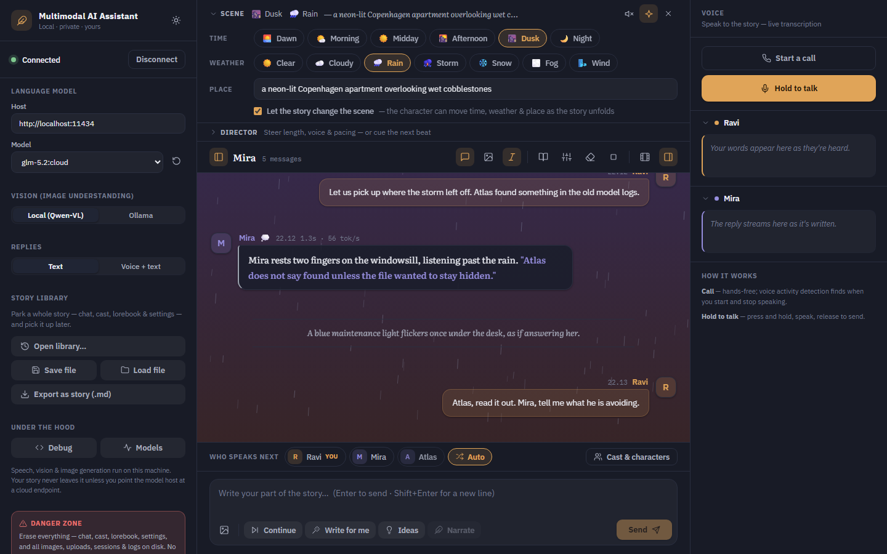
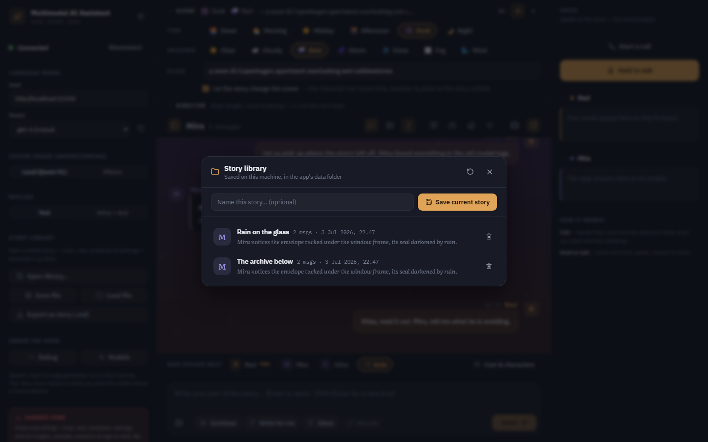
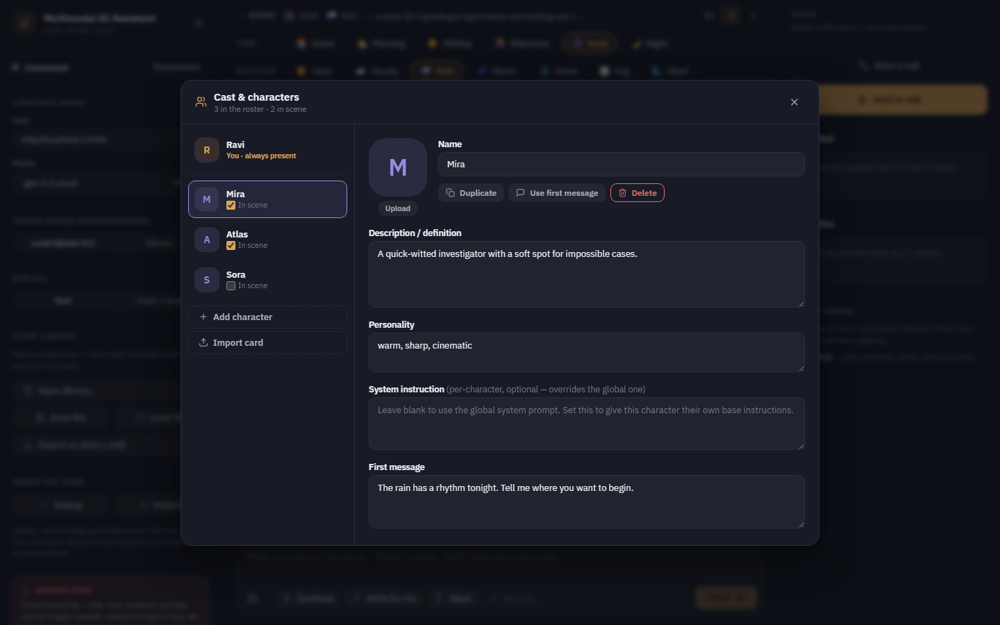

# Multimodal AI Assistant

> A fully-featured (I would like to think so) AI companion (or a poor man's version of AI Girlfriend) that sees, speaks, and creates—all running locally on your machine.

## What is This?

Ever wanted an AI assistant, one that you can set a personality and interact ? One that you can **talk to naturally**, **show images**, and have it **generate visuals** in response? This multimodal AI assistant brings together the best of modern (whatever that is based on my limited understanding) AI capabilities into one seamless (when you have high end PC) experience.

**Note**: This project is being vibe coded (including this ReadMe as well)—built organically and iteratively as ideas flow.

## App Preview

Here is the redesigned story workspace running with demo conversation data: local model controls, scene/director tools, live weather effects, auto-cast, reply stats, realtime voice controls, and the chat composer all in one view.


| Scene controls | Story library |
| --- | --- |
|  |  |

| Cast & characters |
| --- |
|  |

## Key Features

### **Natural Conversations**
- Speak naturally using your microphone—no typing required
- Multiple input modes: voice, text, or text + images
- Real-time voice responses with customizable TTS engines
- Phone call mode (with VAD, for smart turns)

### **Visual Understanding**
- Show it an image and describe what you want
- Powered by local vision-language models for privacy
- Understands context from both your words and images

### **Image Generation**
- Creates images based on conversation context
- The AI can autonomously decide when to generate visuals
- Uses local Stable Diffusion for complete privacy

### **Immersive Roleplay & Storytelling**
- **Multiple characters (cast)** — build a roster, each with its own name, description, personality, avatar, and optional per-character system instruction; mark several "in scene" and pick who speaks next
- **Auto-cast** — or don't pick: let the model direct the group scene and decide which character naturally answers each message
- **Scene atmosphere** — set the time of day, weather, and location; it grounds every reply and tints the conversation's ambient background
- **The living stage** — the backdrop plays the scene: rain streaks, storm lightning, drifting snow, fog, wind, stars at night, fireflies at dusk — plus optional locally-synthesized ambience (rain, thunder, wind, crickets) with no audio files involved
- **Auto-scene** — let the character advance the time, weather, or place itself as the story moves
- **Narrator beats** — drop in omniscient scene narration the characters react to, rendered as distinct scene lines
- **Cinematic mode** — a one-click focused reading view with book typography (Literata) and a mood/scene-reactive backdrop
- **Director controls** — steer length, perspective, pacing, and one-shot scene cues live, without editing prompts
- **Story library** — park a whole story (chat, cast, lorebook, settings) on the backend and pick it up later; export any conversation as a Markdown story
- Lorebook/World Info, Author's Note, moods, swipes, per-reply generation stats, and SillyTavern-compatible character cards

### **Privacy-First**
- Everything runs locally—no cloud dependencies required (optional)
- Your conversations and images never leave your machine
- Optional cloud LLM support for those who don't have powerful hardware

## How It Works

1. **Input** → Talk, type, or share images with the assistant
2. **Understanding** → Vision models describe images, speech is transcribed
3. **Thinking** → Your chosen LLM processes everything as natural conversation
4. **Response** → Get spoken responses and generated images in real-time

## Tech Stack

- **Speech-to-Text**: Faster Whisper (local transcription)
- **Vision Understanding**: Qwen3VL-2B/4B (local vision-language model)
- **Language Model**: Ollama (supports local and cloud deployment)
- **Image Generation**: Stable Diffusion / Qwen Image Edit
- **Text-to-Speech**: Multiple engines (Piper, Chatterbox, Soprano)
- **Frontend**: React + TypeScript + Vite
- **Backend**: FastAPI + WebSockets

## Quick Start

### 1. Clone the Repository

```bash
git clone https://github.com/yourusername/multimodal-ai-assistant.git
cd multimodal-ai-assistant
```

### 2. Install Dependencies

```bash
# Install Python dependencies
pip install -e .

# Frontend is automatically built during pip install
# If you need to rebuild manually:
cd frontend
npm install
npm run build
cd ..
```

### 3. Configure Environment Variables

Copy the example environment file and configure it:

```bash
# Windows
copy src\aiassistant\.env.example src\aiassistant\.env

# Linux/Mac
cp src/aiassistant/.env.example src/aiassistant/.env
```

Edit `src/aiassistant/.env` with your preferred settings. See [Configuration Guide](#configuration-guide) below for details.

### 4. Download Required Models

See [Model Setup](#model-setup) section for detailed instructions on downloading and configuring models.

### 5. Run the Application

```bash
# Start the backend server
python -m aiassistant.app

# The application will be available at http://localhost:8000
```

## Configuration Guide

All configuration is done through environment variables in the `.env` file. Here are the key settings:

### Low VRAM Mode

```bash
LOW_VRAM_MODE=true  # Unloads models after use to save memory
```

### LLM Configuration

**Option 1: Local Ollama (Recommended)**
```bash
LLM_HOST=http://localhost:11434
LLM_MODEL=llama3.2  # or mistral, qwen2.5, etc.
LLM_DEVICE=auto     # auto, cuda, or cpu
```

1. Install Ollama from https://ollama.com/download
2. Pull a model: `ollama pull llama3.2`
3. Start Ollama service

**Option 2: Ollama Cloud**
```bash
LLM_HOST=https://ollama.com
LLM_MODEL=glm-4.7:cloud
```

Get an API key from https://ollama.com

**Option 3: Custom Implementation**

You can implement your own LLM provider by extending the base class in `src/aiassistant/llm/base.py`.

### Speech-to-Text (Whisper)

```bash
WHISPER_MODEL=distil-medium.en  # or tiny.en, base.en, small.en, medium.en, large-v3
WHISPER_DEVICE=cuda             # cuda or cpu
WHISPER_COMPUTE=float16         # float16, float32, or int8
```

Models are automatically downloaded from HuggingFace on first run.

### Text-to-Speech

**Option 1: Piper TTS (Default - Fast & Lightweight)**
```bash
TTS_ENGINE=piper
PIPER_USE_CUDA=true
```

Download voices from: https://huggingface.co/rhasspy/piper-voices/tree/main

Place `.onnx` and `.json` files in: `src/models/voices/pipertts/`

**Option 2: Chatterbox TTS (Expressive)**
```bash
TTS_ENGINE=chatterbox
CHATTERBOX_DEVICE=cuda
```

Requires: `pip install chatterbox-tts`

**Option 3: Soprano TTS (Fast & Lightweight)**
```bash
TTS_ENGINE=soprano
SOPRANO_DEVICE=cuda
```

Requires: `pip install soprano-tts`

### Image Generation

```bash
IMAGEGEN_ENABLED=true
IMAGEGEN_MODEL=prompthero/openjourney  # HuggingFace model ID or local path
IMAGEGEN_DEVICE=cuda
IMAGEGEN_WIDTH=512    # Lower for less VRAM (512x512 = ~6GB VRAM)
IMAGEGEN_HEIGHT=512
IMAGEGEN_STEPS=30     # 20-30 for speed, 40-50 for quality
```

Popular models:
- `prompthero/openjourney` - Fast, small VRAM
- `runwayml/stable-diffusion-v1-5` - General purpose
- `stabilityai/stable-diffusion-2-1` - Better quality

Models are downloaded from HuggingFace on first run, or you can point to a local directory.

**ComfyUI Integration (Coming Soon)**

You can implement ComfyUI endpoints by extending `src/aiassistant/imagegen/base.py`.

### Image Explainer (Vision-Language Model)

```bash
IMAGEEXPLAINER_ENABLED=true
IMAGEEXPLAINER_MODEL=Qwen/Qwen3-VL-2B-Instruct
IMAGEEXPLAINER_DEVICE=auto
```

Models:
- `Qwen/Qwen3-VL-2B-Instruct` - 2B params, lower VRAM
- `Qwen/Qwen3-VL-4B-Instruct` - 4B params, better quality

Models are downloaded from HuggingFace on first run.

## Model Setup

### Directory Structure

Models are stored in `src/models/`:

```
src/models/
├── image_explainer/        # Vision-language models (auto-downloaded)
├── image_generation/       # Diffusion models (auto-downloaded)
├── stt/                   # Whisper models (auto-downloaded)
├── tts/                   # TTS models (auto-downloaded)
└── voices/
    └── pipertts/          # Piper voice files (manual download)
```

### Piper Voice Setup

1. Visit https://huggingface.co/rhasspy/piper-voices/tree/main
2. Choose a voice (e.g., `en_US-lessac-medium`)
3. Download both files:
   - `en_US-lessac-medium.onnx`
   - `en_US-lessac-medium.onnx.json`
4. Place in `src/models/voices/pipertts/`

### Whisper Model Setup

Models are automatically downloaded on first use. Specify the model name in `.env`:

```bash
WHISPER_MODEL=distil-medium.en
```

### Image Generation Model Setup

**Option 1: Auto-download from HuggingFace**

```bash
IMAGEGEN_MODEL=prompthero/openjourney
```

**Option 2: Use local model**

```bash
IMAGEGEN_MODEL=/path/to/your/local/model
```

### Image Explainer Model Setup

Models are automatically downloaded on first use:

```bash
IMAGEEXPLAINER_MODEL=Qwen/Qwen3-VL-2B-Instruct
```

## Usage

1. Open http://localhost:8000 in your browser
2. Click the microphone button to start voice input
3. Speak naturally or type your message
4. Attach images by clicking the image button
5. The AI will respond with voice and/or images

## Development

See [BUILD_INSTRUCTIONS.md](BUILD_INSTRUCTIONS.md) for detailed build system information.

### Frontend Development

```bash
cd frontend
npm run dev  # Starts dev server with hot reload at http://localhost:5173
```

### Backend Development

```bash
python -m aiassistant.app  # Runs backend server
```

## Perfect For

- Privacy-conscious users wanting local AI assistants
- Anyone who wants a truly interactive AI companion

## Future Plans

### Live 2D/3D Character with Emotions

The ultimate vision is to have an animated 3D model of your choice that reacts and interacts during conversations, something similar to VTuber. Using technologies like Qwen ControlNet, image editing pipelines, PyGame, Wan, and all other opensource video/image generation models it should be possible to create a fully animated avatar that:
- Lip-syncs to generated speech
- Shows expressions and reactions based on conversation context
- Responds with gestures and body language (essentially a more advanced version of microsoft CLIPPY, yes I am OLD)

Features would include:
- Lip-sync to generated speech
- Facial expressions based on conversation context
- Gestures and body language
- Real-time emotion detection and response

This is a long-term pipe dream, but with current AI models advancing rapidly, it should become feasible soon. Think of it as a more advanced, AI-powered Microsoft Clippy! 📎

### Other Planned Features

- Support Docker
- Group chat with autonomous turn-taking (multiple characters replying on their own)
- Conversation memory and context management
- Voice cloning for personalized TTS
- Custom image generation styles and LoRA support
- Export/import conversation history
- Plugin system for custom engines

## Contributing

Contributions are welcomed! Whether you want to:
- Add support for new LLM providers
- Implement new TTS/STT engines
- Integrate ComfyUI or other image generation backends
- Improve the UI/UX
- Fix bugs or add features

### How to Contribute

1. Fork the repository
2. Create a feature branch (`git checkout -b feature/amazing-feature`)
3. Make your changes
4. Test thoroughly
5. Commit your changes (`git commit -m 'Add amazing feature'`)
6. Push to the branch (`git push origin feature/amazing-feature`)
7. Open a Pull Request


## Acknowledgments

- Claude for keeping up with my weird requests

